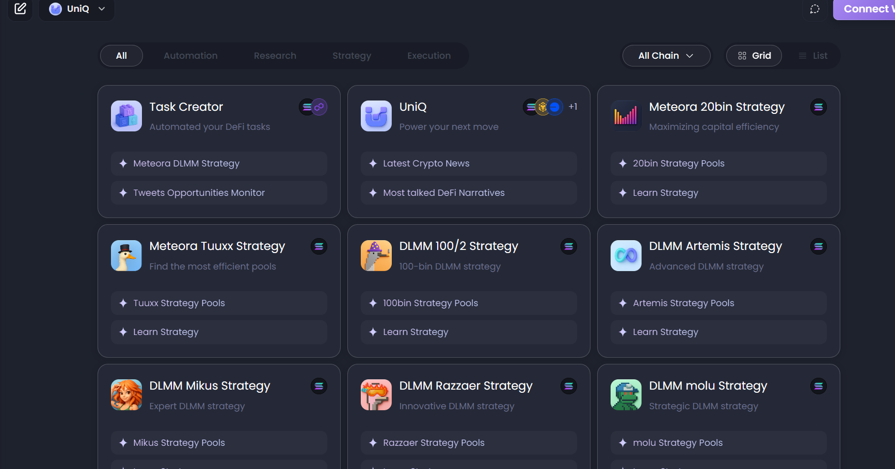

# What Is UniQ?

<figure><figcaption></figcaption></figure>

UnifAI Network is an innovative, AI-native platform designed to empower the creation, deployment, and collaboration of autonomous AI agents within a decentralized ecosystem. By leveraging advanced artificial intelligence, blockchain technology, and dynamic tool integration, UnifAI Network aims to redefine how AI agents interact, collaborate, and deliver value across various industries. This essay provides an in-depth exploration of the UnifAI Network, its core components, objectives, and potential impact, drawing from available information and critical analysis.
